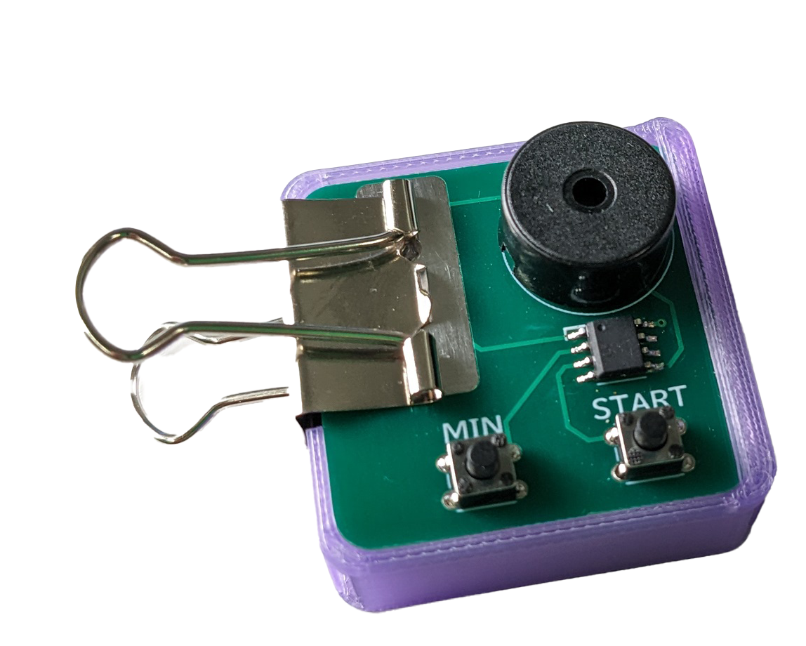
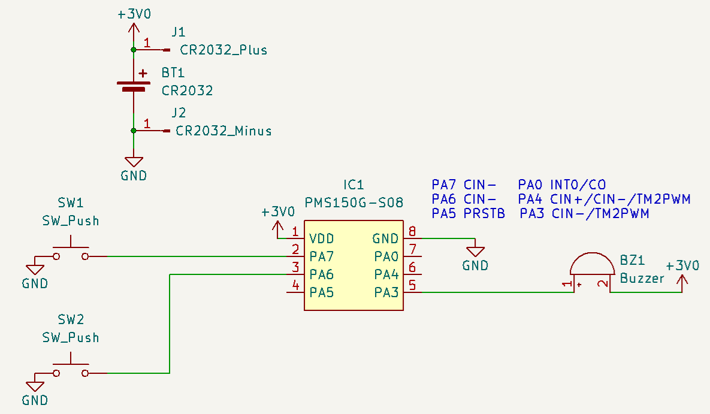

# clover-timer
Simple Countdown Timer using Padauk MCU

## docs
- [組み立て方（Japanese）](./docs/assembly-instruction.pdf)
- [配付資料（Japanese）](./docs/assembly-instruction-short.pdf)

## schematic

Only supports PMS150G for now, but should be able to run on other Padauk MCUs with modifications.

## License
GPLv3

This project is based on:
- [Padauk-tone](https://github.com/Kashouryo/Padauk-tone) by Kashouryo, MIT License
- [pdk-digital-clock](https://github.com/serisman/pdk-digital-clock) by serisman, GPLv3

