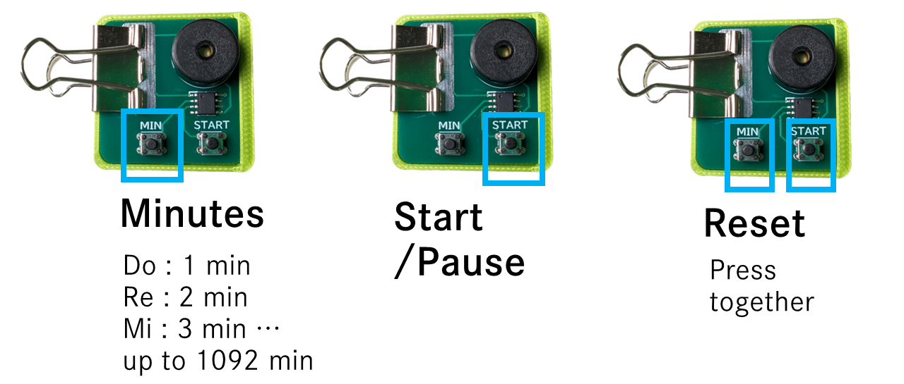

# clover-timer
Simple Countdown Timer using Padauk MCU

## Docs
- [組み立て方（Japanese）](./docs/assembly-instruction.pdf)
- [配付資料（Japanese）](./docs/assembly-instruction-short.pdf)

## Schematic

Only supports PMS150G for now, but should be able to run on other Padauk MCUs with modifications.

### Power Consumption
- 350 μA (Countdown)
- 55  μA (Sleep)

Fall sleep in 2.5s

## BOM
| Ref | Part # | Description | Purchase | Price |
| --- | ------ | ----------- | -------- | ----- |
| IC1 | Padauk PMS150G | MCU | [LCSC](https://www.lcsc.com/product-detail/Microcontroller-Units-MCUs-MPUs-SOCs_PADAUK-Tech-PMS150G-S08_C2909819.html) | $0.04 each |
| SW1, SW2| TS4548CJ | Push Switch. Others are OK (Check footprint) | [LCSC](https://www.lcsc.com/product-detail/_SHOU-HAN-_C5359333.html) | $0.008 each |
| BZ1 | SFN-1407PA7.6 | Passive Buzzer | [LCSC](https://www.lcsc.com/product-detail/_S-S-_C360603.html) | $0.05 each |
| Battery | CR2032 | 3V Litium Battery Cell | - | $0.1~ each |
| - | Case | 3D printed case | Print by yourself | [STL](./case/bottom_rev0f.stl) |
| - | Binder Clip | Clip for Battery Case | - | $0.05~  each|
| - | Jigu(Optional) | Cardboard Jigu for Battery Case | Cut by yourself | [Data](./case/jigu_laser_rev2.dxf) |
| - | Magnet(Optional) | Φ18*5mm Magnet | - | $0.05~ each |

## Usage

## License
GPLv3

This project is based on:
- [Padauk-tone](https://github.com/Kashouryo/Padauk-tone) by Kashouryo, MIT License
- [pdk-digital-clock](https://github.com/serisman/pdk-digital-clock) by serisman, GPLv3

